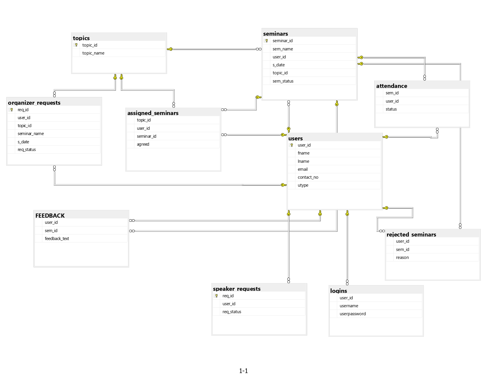

# Overview

This project was developed to demonstrate the concepts of `database management` along with the usage of `object orientation` in C#.
This system uses local database server (mssql) and winforms for the GUI.

# Introduction

Seminar Management System is a software system designed to help organizations and universities to manage the seminars. This system helps the organizers of the seminar to control different aspects of seminars ranging from the registration of attendees to the feedback of the organized seminars. By automating the flow of organizing seminars, such as registration, tracking speakers and attendees, and collecting feedback, organizers can save time and easily organize successful seminars. In short Seminar Management System provide an efficient way to ensure the flawless experience for both organizers and participants.

### The Seminar Management System will feature

1. Secure Login: Role-based access control ensures data security and privacy for staff with different user levels.

2. Relational Database: A relational database for storing seminar details, attendees’ information, seminars history, speakers’ information, and attendance.

3. User Interface: User-friendly interface designed specifically for quick access to functionalities.
 

### ER Diagram

